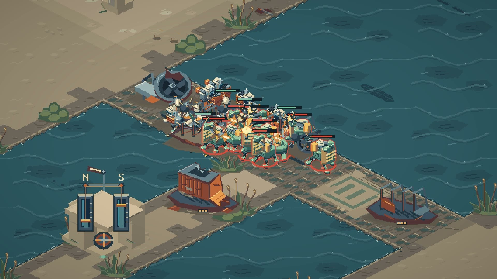
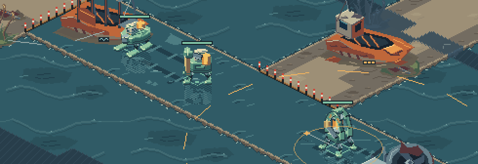
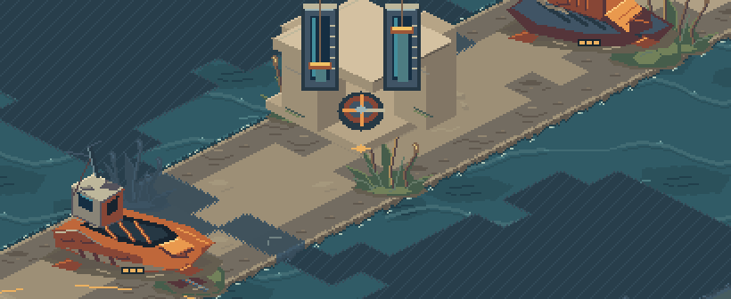

# BRINEWAKE

A real-time strategy game on the floor of a vanished sea. Take the sluice that
moves the tide, dry a crossing for your own army or drown the one the enemy
needs, and turn it into a raid, a timing or the fight that ends the match.

**[Watch the trailer and download the game at danprice.ai/brinewake](https://danprice.ai/brinewake)**
· [Releases](https://github.com/halfprice06/brinewake/releases)

BRINEWAKE is an alpha. It is free, it runs on macOS (Apple Silicon) and
Windows, and everything here — code, art and music — is MIT licensed.

## The game

- **The tide.** Two crossings cut the basin. Whoever holds the sluice dries
  one and drowns the other, or floods both. Shallow water slows machines and
  hurts them more; deep water stops ground machines entirely.
- **Two ways to win.** Break the enemy's headquarters, or hold both
  crossings for ninety seconds.
- **Three sides.** The Breakwater Union (heavy on dry ground), the Silt
  Assembly (works with the water) and the Saltglass Compact (fast, fragile,
  lays causeways over the tide), each with its own machines and buildings.
- **Two maps.** The Split Basin for two players and the Confluence for
  three.
- **Online with friends.** One player hosts and shares a join code; there is
  no account and no server. Or play the computer, after a short guided match
  that teaches the basics.
- **A custom engine.** Deterministic fixed-point simulation in Rust, native
  pixel art composited at integer scales, and music and sound synthesized in
  real time and adapting to the match.

## Download and install

Get the newest build from [danprice.ai/brinewake](https://danprice.ai/brinewake)
or the [releases page](https://github.com/halfprice06/brinewake/releases).

- **macOS** (Apple Silicon, macOS 12 or later): open the disk image, drag
  BRINEWAKE into Applications and open it. The app is signed and notarized.
- **Windows** (10 or 11, 64-bit, DirectX 12 or Vulkan): unzip the folder
  anywhere and run `BRINEWAKE.exe`. Until the Windows build is code-signed,
  Windows may say it protected your PC: choose More info, then Run anyway.

You start a launcher, not the game itself. Each time it checks for a newer
version, downloads it, verifies its signature and installs it before the game
opens; without a connection it starts the version you have. Your settings and
saves carry over.

To uninstall on macOS, delete BRINEWAKE from Applications and the folder
`~/Library/Application Support/Brinewake` (the installed game, your settings
and saves). On Windows, delete the folder you unzipped,
`%LOCALAPPDATA%\Brinewake` (the installed game) and `%APPDATA%\Brinewake`
(your settings and saves).

Controls, rules and online play are covered in [docs/CONTROLS.md](docs/CONTROLS.md)
and in `HOW TO PLAY.txt` inside the Windows download.

## Build from source

You need Rust 1.90 or newer.

    cargo run --release -p bw_desktop --bin brinewake     # or ./run.sh
    cargo test --workspace

macOS on Metal is the main platform. Windows builds are cross-compiled with
MinGW (`tools/package_windows.sh`) and tested in CI on a Windows machine.
Linux builds (it needs `libasound2-dev` and `pkg-config`) but has not been
played. See [docs/DEVELOPMENT.md](docs/DEVELOPMENT.md) for two-player and
headless sessions, replays, review tools, releases and the trailer.

### Repository layout

| Path | What it is |
|---|---|
| `crates/bw_core` | Shared types: fixed-point positions, kinds, the camera |
| `crates/bw_content` | Rules data: machines, buildings, costs, the rules version |
| `crates/bw_sim` | The deterministic simulation, navigation, maps and the practice AI |
| `crates/bw_desktop` | The game: rendering, interface, audio, networking, tools |
| `crates/bw_launcher` | The launcher that keeps the game up to date, and the release tool |
| `crates/bw_tools` | Command-line checks: skirmishes, replays, benchmarks |
| `art/source` | Editable Aseprite documents for every art pass |
| `art/exports` | The atlas and icons the game loads |
| `tools/art_v*` | Scripts that build the atlas in Aseprite (v21–v23 are current) |
| `tools/agent_play` | A harness for headless matches driven by agents |
| `docs/` | The design document, networking, controls and development notes |

## Privacy and the network

BRINEWAKE has no accounts and no telemetry. The launcher contacts
danprice.ai and GitHub to check for and download updates. Online play
connects directly to the other players; to find a route it asks public STUN
servers (Google and Cloudflare) for your public address and may ask your
router to open a port (UPnP). Nothing else leaves your computer.

## How it was made

BRINEWAKE was built with AI coding agents working under one person's
direction and review. That includes the code, the music (composed as note
data and synthesized by the game) and the art. The art was made in
Aseprite, mostly by scripts that place every pixel; the scripts are in
`tools/art_v*` and the editable results in `art/source`, with a README per
pass describing how it was made.

## License

MIT, for the code, the art and the music: see [LICENSE](LICENSE). The
releases include the licenses of the Rust crates the game is built with
(`THIRD-PARTY-LICENSES.html`). Code signing policy: [docs/CODE-SIGNING.md](docs/CODE-SIGNING.md).
