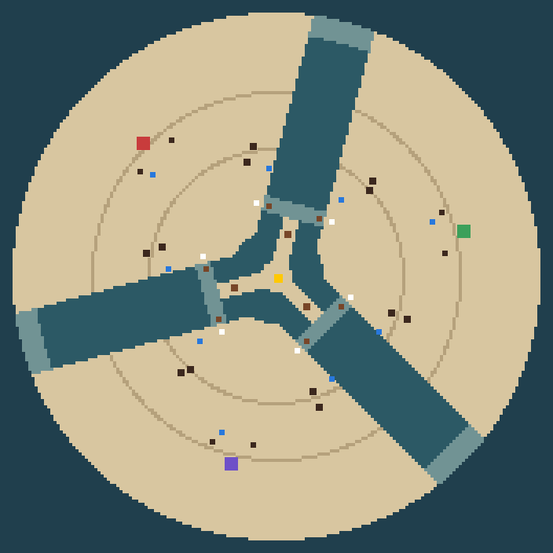

# A third faction and a three-player map

**Approved by the owner 2026-09-23 (free-for-all; the Compact without a
transport; the names). Not yet built.**
Every number is a seed in the style of `bw_content::spec`, chosen against
rules 17, and is a hypothesis until trials play it. `docs/DESIGN.md` §20 carries the
summary; this file carries the detail. Where they disagree, `docs/DESIGN.md` governs.

The owner's ask: "design a third race and a map that can support generally the
same mechanics but with three teams. The map will need to be a little bigger."

## The choices, up front

1. **The Saltglass Compact** is the third faction. Salt-pan crews who stayed on
   the flats, fire brine with mirrors and fuse salt into glass. The Union
   blocks the water, the Assembly works with it, and the Compact makes ground
   over it. It is the fast, fragile side: the quickest line on dry ground, a
   mirror dish whose beam builds up on one target, a long thin line of sight,
   and a machine that lays salt causeways over tidal water. The catch is that
   anybody can walk on a causeway.
2. **It has eight machines in the same slots as the others, with one deliberate
   difference.** Its answer to the tide wall is the Salter's causeway, not a
   transport, so its eighth machine is the Pan. The Pan is a mobile pressure
   still that needs no well.
3. **The Confluence** is the three-player map. It is a round salt basin, 176
   cells across, ringed by sea and cut into three wedges by a Y of water. Every
   pair of players shares one arm of the Y. Each arm has a lane near the middle
   and a rim at the coast. The station stands on a three-pointed island where
   the arms meet, and each point touches one lane. That makes it about the same
   size on screen as the Split Basin, which is a 4,096 px diamond at 1×; the
   Confluence is a 3,800 × 1,900 px ellipse. It has about 5,840 cells of land
   a player, where the Split Basin has about 6,000 a side.
4. **The tide picks the duel.** The station's holder dries one arm (DRY E,
   DRY W or DRY S) or floods them all. A dry arm joins the two players on its
   banks to each other and to the island. The third player is walled off until
   the tide changes, and can reach nobody without a transport or a causeway.
   Neutral (all shallow) still opens every match.
5. **The tide victory is the same rule for each player.** You win if you own
   the station and hold both lanes that touch your land for ninety seconds of
   gauge. Only the station's owner can count, so there is never more than one
   banner, and both other players see it.
6. **Free-for-all, last headquarters standing.** A fallen headquarters (the
   keel rule still applies) or a surrender eliminates that seat. The match
   goes on until one seat is left or someone holds the tide. The first build
   has no alliances, no shared vision and no trading.
7. **Every opponent gets its own colour.** Your own machines stay jade. Your
   two opponents are red and violet, and the same colour shows on the field,
   the chart, the banner and the summary. Two enemies must be told apart at a
   glance, and a mirror match (two seats on one faction) needs it too.
8. **Seats and networking.** The simulation, the harness and the interface
   become N-seat, with two and three supported. The "Peer-to-peer
   multiplayer" thread owns the session and network code. This design lists
   what three seats need from it and does not change it.

## 1. The Saltglass Compact

### Who they are

When the sea went out, the salt-pan families did not follow it. Their flats
flood a little every tide, so they build on stilts. They boil brine in pans
fired by banks of mirrors, and they fuse salt and sand into glass for lenses,
floats and plate. The Union wants to engineer the coast and the Assembly wants
to live with the tide. The Compact wants the water gone for good and the land
fixed, and it is drying out the wetlands the Assembly's cooperatives live on
to get there. None of the three is the monster.

### How they look

The faction's silhouette family is **tall and thin**: stilt legs, masts,
mirror dishes on yokes, glass lenses and hanging pans. The Union's machines
are low and broad and the Assembly's are arched and paddled. Its materials
are glazed ceramic plates in a deep cobalt-violet glaze with white salt-crust
at the joints, copper and brass fittings, and clear glass that catches the
light.

The palette starts from the existing `plum` and `glass` ramps. It adds one
glaze ramp and a salt-white, and a lens glint is the one bright accent. It
keeps away from the Union's cream and orange and the Assembly's pale jade,
straw and amber. A pale machine on pale salt is the risk, so the dark glaze
carries the body mass, and the greyscale test against salt and water comes
first.

The art follows plan §8, the
art v19 walk rules and the no-shadow-under-buildings rule.

### How they play

- **Speed on dry ground.** The Brander is the fastest line machine in the
  game (4 against 3), but it has the least hull and range.
- **Focus.** The Heliostat's beam gains damage with every shot on the same
  target, so it takes apart one heavy machine or building at a time. It is the
  counter to a deployed Bulwark line, a dug-in Caisson, a deployed Loom or a
  nest. Many cheap targets beat it, because every switch starts the build-up
  again.
- **A different way of seeing.** SOUND lights a circle. GLINT lights a long,
  thin ray: it can look down a lane, across an arm or out to a Loom line from
  the flank.
- **Making ground.** The Salter crusts tidal water into a three-cell causeway
  that stays dry until the tide next changes, even through a flood. It
  reopens a crossing the tide closed, for everyone. The station's holder
  washes it away by changing the tide.
- **Weak spots.** The Compact is fragile, has no wet economy and no transport,
  and its causeways help its enemies as much as itself. The Pan spreads its
  pressure across the map as soft targets.

### Roster, in `bw_content::spec` terms

| Machine | Hull | Damage | Range | Speed | Cooldown | Cost | Build | Crew | Sight | Move | Role |
| --- | ---: | ---: | ---: | ---: | ---: | --- | ---: | ---: | ---: | --- | --- |
| Raker | 65 | 3 | 1 | 3 | 30 | 50S | 12s | 1 | 7 | Walker | Worker |
| Brander | 127 | 13 | 3 | 4 | 24 | 75S | 15s | 2 | 8 | Walker | Fast line fighter (fire-lance); 110 hull before rules 20 |
| Heliostat | 200 | 2→10 | 6 | 2 | 12 | 150S 40P | 26s | 4 | 9 | Walker | Deploys to fire a beam: +1 damage a shot on the same target, up to 10; 150% to buildings |
| Glinter | 90 | 8 | 5 | 5 | 26 | 80S 10P | 16s | 2 | 11 | Walker | Harasser; carries GLINT; 80 hull before rules 20 |
| Stilt | 60 | — | — | 6 | — | 40S | 10s | 1 | 16 | Walker | Scout; sight doubled on Hold; trained at the HQ (W) or the Drydock |
| Glazier | 80 | — | — | 3 | — | 90S 20P | 16s | 2 | 8 | Walker | Mender |
| Salter | 180 | — | — | 2 | — | 130S 30P | 20s | 2 | 8 | Walker | Lays salt causeways over tidal water (LAY) |
| Pan | 120 | — | — | 2 | — | 110S 20P | 18s | 2 | 6 | Walker | Deploys on dry ground: +40 pressure a minute |

Works trains the Brander, the Heliostat and the Glinter. The Drydock trains
the Stilt, the Glazier, the Salter and the Pan. The scout, worker and mender
match the other factions number for number, as the existing ones already
match each other.

How the numbers were set, against the machines they will meet:

- **Brander.** It does 16.3 damage a second: 15 for the Riveter, 11.1 for the
  Reedguard. It has 110 hull (125, 150), reach 3 (4, 4), speed 4 (3, 3) and
  costs 75 salvage (70, 80). It takes a volley while it closes and gets there
  sooner. A committed trade against a Reedguard line with Plate should lose.
- **Heliostat.** It does 5 a second on a fresh target, rising to 25 a second
  after nine shots (3.6 s). That is about 13.6 s to kill a Bulwark (300) and
  7.6 s for a Reedguard (150), against the Loom's 13.3 a second at 7–8 cells
  with a blast (8–9 before rules 21). Its reach of 6 is under a sieged Loom's
  8, so artillery beats it. Like the Loom, it is lit for the side it fires at while it fires
  (`LOOM_FIRE_REVEAL_*`), and the beam is drawn as a line.
- **Glinter.** Sits between the Sounder (85 hull, 7 damage, reach 5, 12
  sight) and the Skipper (100, 9, 4, 10).
- **Salter.** Laying costs 3 pressure a row of three cells. Bridging an arm 20
  cells wide takes 20 s and 60 pressure. A tide switch costs 40 and a flood
  80, so a causeway costs about the same as the change it undoes.
- **Pan.** A condenser pays 120 a minute for 140 salvage on a well. Three Pans
  pay the same for 330 salvage, 60 pressure and 6 crew, anywhere dry. A Pan is
  worse than a condenser, but no well is needed.

### Abilities

| Ability | Who | Cost | Effect |
| --- | --- | --- | --- |
| Deploy (D) / pack (P), keep deployed (K) | Heliostat, Pan | — | As for the Bulwark and Loom: one second each way. A deployed Heliostat fires; a deployed Pan makes pressure |
| Beam | Heliostat | — | Shots on the same target gain 1 damage each, from 2 to 10. A new target, or three seconds without a shot, starts again from 2. The Heliostat is lit for its target's side, 2 cells around it, for 3 s after a shot |
| GLINT (X, then a point) | Glinter | 20 pressure | Lights a ray 18 cells long and 3 wide toward the point for five seconds. SOUND lights 254 cells in a nine-cell circle; GLINT lights 54, reaching twice as far |
| LAY (L, then a tidal cell) | Salter | 3 pressure a row | The Salter walks to the nearest bank and crusts a strip three cells wide toward the point, one row a second, up to 24 rows. It stands on the head of the strip while it works. It can crust any tidal cell (lane or rim) at any tide, but never permanent deep water, so it cannot bridge to the island except by a lane. The crust is dry ground for everyone until the tide next changes: a switch, a flood arriving or a flood falling. A machine on crust that turns deep is swamped, as on any tidal cell |
| Surge (Z) | Brander, Glinter, Heliostat (packed) | 10 pressure each | As for the others |
| VENT, RECLAIM | The Kiln | as now | As for the others |

GLINT gives the Compact a way to see like the other two sides without being
a copy of SOUND. LAY gives it an answer to the wall that works on the ground,
changes the ground for everybody, and gives the station's holder something to
do about it. That keeps the plan §1 pillar: "a readable map that players can
change".

### How the Compact argues with the others

- Branders catch Sounders, Skippers, workers and menders in the open. They
  lose a straight fight to a Reedguard line behind Looms, and they lose to a
  deployed Bulwark from the front.
- A Heliostat on a deployed Bulwark or Caisson is the Union's problem to
  solve. The answer is to flank it, or to feed it cheap targets, since every
  new target restarts the build-up.
- Against the Assembly, a sieged Loom outreaches a Heliostat by two cells
  (three before rules 21), so the Compact finds the Loom line with GLINT and
  closes with Branders on Surge; since rules 21 a Glinter hits a deployed
  Loom for 5 more a shot, as the Sounder does.
- The Salter's causeway is the Compact's flood answer. The Union and the
  Assembly cross a flood with a hull or wings. The Compact rebuilds the lane,
  and anyone may follow it across.
- The Compact holds a crossing mouth with its gun machines, as the others do
  (`holds_mouth_unit` already counts every gun machine). It has no Caisson,
  so its holds are cheaper and easier to break.

### Buildings

The building kinds are shared, so the numbers are unchanged. Only the names
and the art are the Compact's own.

| Function | Union | Assembly | Compact |
| --- | --- | --- | --- |
| Headquarters | Dockhouse | Hearth | **Kiln** |
| Basic production | Works | Loomyard | **Glassworks** |
| Drop-off | Salvage yard | Sorting cradle | **Rake shed** |
| Pressure | Condenser | Condenser | Condenser |
| Tier two | Drydock | Drydock | Drydock |
| Defence | Defence nest | Defence nest | Defence nest (a mirror nest to look at) |
| Wall | Palisade | Palisade | Palisade (salt block) |

### Tech and doctrine

Everything in plan §5 applies, with two faction readings:

- **Plate** (Works) covers the Brander and the Heliostat, the Compact's line
  and its deploying heavy, as it covers the Union's Riveter and Bulwark.
- **Siege** (Works): the Heliostat gains +2 a shot instead of +1 and deploys in
  half the time.

Temper, Tracks, Refit, Cranes, Salvage Sonar, Scrap Recovery, Overpressure,
Bleed Valves and both doctrines, with their second tiers, are the same for all
three factions.

### In two-player matches

The Compact plays on the Split Basin too. Once three factions exist, a
two-player match takes each seat's faction from the menu instead of "the
opposite of the host's", and mirror matches become possible. Nine pairings
replace two, and the practice opponent and the Guide's roster page need the
third faction whichever map is played.

## 2. The Confluence

The sketch shows the simulation grid from above, one pixel a cell, drawn at
4×. Tan is salt, the grey rings are silt, dark blue is deep water, and light
blue marks the tidal lanes and rims. The coloured squares are the three
headquarters, dark dots are wreck beds, blue dots are wells, white dots are
crossing mouths and the yellow dot is the station. In the game's dimetric
view the grid turns 45°: seat **T** sits at the top of the screen and **R**
and **L** at the lower right and lower left. The arms run east, west and
south on screen, and the plan names them that way.

### Layout

The layout comes from `tools/maps/confluence_sketch.py`, which rasterises it
and measures it:

| Feature | Where (grid cells, 176×176, centre (88,88)) |
| --- | --- |
| Ring sea | every cell more than 84 cells from the centre; deep and permanent |
| Central pool | within 15 cells of the centre; deep and permanent |
| Arms | three channels, 20 cells wide, from the pool to the ring sea, at grid angles 285° (E on screen), 165° (W) and 45° (S). Deep and permanent, apart from the lanes and rims |
| Lanes | across each arm, 19–24 cells out from the centre, 5 wide. Tidal: the arm's lane |
| Rims | across each arm, from 77 cells out to the coast, about 7 wide. Tidal: the arm's rim |
| The island | salt: a core 5 cells across the centre, and a point 5 wide running up each arm to touch that arm's lane in its middle. The station is at (88,88) |
| Silt | two rings on land, 40 and 58 cells out, at 95% speed |
| Seats | headquarters at T (45,45), R (147,73) and L (73,147); six workers each |
| Home beds, 1,600 each | T (44,54) (54,44); R (140,67) (141,80); L mirrored |
| Side beds, 2,400 each | two pairs a seat, one pair toward each neighbour: T (46,80) (51,78) (80,46) (78,51); R (118,57) (117,60) (129,101) (124,99); L mirrored |
| Wells | three a seat, nine in all: T (48,55) (53,85) (85,53); R (137,70) (108,63) (120,105); L mirrored |
| Crossing mouths | two a lane, one on each bank: E (81,64) (105,70), W (64,81) (70,105), S (111,94) (94,111) |
| Lane wrecks, 900 each | six, one beside each mouth inside the lane: (85,65) (101,69) (65,85) (69,101) (108,97) (97,108) |
| Deep wrecks, 1,500 each | three, one on each island point: (91,74) (74,91) (97,97) |

The three seats are not rotated copies of one another. Paths on the grid
count a diagonal step as 1.41, so a layout rotated by 120° would give one
seat routes up to 8% longer. The map is instead mirrored across the grid
diagonal, x ↔ y, which keeps path lengths exact: R and L are mirror images,
and T sits on the mirror line. T's placement was then tuned by measurement.
The sketch reports these distances (octile path search, 8 neighbours, no
corner cutting, as `navigation.rs` does it):

| Measure, in cells of travel | T | R and L |
| --- | ---: | ---: |
| Headquarters to station, every lane dry | 75.2 | 74.2 |
| Headquarters to station at neutral (wading) | 78.0 | 76.8 |
| Headquarters to its own two mouths | 43.8, 43.8 | 43.3, 44.6 |
| Headquarters to each neighbour's headquarters | 113.6 | 113.6 (to T), 112.0 (R to L) |
| To the home beds / side beds / side wells | 9.5 / 35.4–35.5 / 43.3 | 9.5 / 35.4–35.6 / 43.2 |
| Land nearer to this seat than any other | 5,904 cells | 5,812 and 5,799 |

Every measure is within 2%. Measured the same way, a Split Basin
headquarters is 46.2 cells from its mouths, 71.2 from the station and 117.7
from the enemy's headquarters. The Confluence keeps today's walking times.

Construction is refused where it is today: tidal ground, the sluice approach,
unexplored ground, occupied cells, and a condenser off a well.

### The tide with three arms

| Tide | E arm (T–R) | W arm (T–L) | S arm (R–L) | Who can walk to whom |
| --- | --- | --- | --- | --- |
| Neutral (every match starts here) | shallow | shallow | shallow | everyone, wading, and everyone to the island |
| DRY E | dry | deep | deep | T and R to each other and to the island; L walled off |
| DRY W | deep | dry | deep | T and L; R walled off |
| DRY S | deep | deep | dry | R and L; T walled off |
| FLOOD | deep | deep | deep | nobody, for 45 s; then it falls back to the arm that was last dry |

Prices, warnings, the 45-second lock, capture work, the contest ring and the
switch guard are all as plan §3 has them. The one change is that a switch
names an arm instead of north or south. That leaves the holder with three
kinds of choice, each with its own cost:

- **Open to a neighbour** (dry your own arm with R). You and R fight, L can't
  interfere, and only R can reach your garrison on the island.
- **Set the other two on each other** (dry the arm between R and L). They are
  joined, you are walled off, and both of them can now walk onto your island.
  It is the classic third-party move, and it puts the station within reach of
  the two players it was used against.
- **Flood** everything for 45 s, at 80 pressure.

Whoever the dry arm joins can always reach the station, so no tide setting
lets its holder hide the objective. A walled-off player still has three
answers: a transport (the Union's Lifter, the Assembly's Barge), a Salter's
causeway (the Compact), or waiting 45 seconds for the lock to lapse.

### Victory with three

- **The tide.** You own the station and hold both lanes that touch your land,
  each by your own gun machine or Caisson within four cells of either of its
  mouths, with no opponent's at either. Ninety seconds of gauge wins
  outright. The gauge rises and drains as now. It is the two-player rule
  applied to each of your two frontiers: to count, you must have both
  neighbours off their own bank's mouths. Only the owner of the station can
  count, so there is at most one banner, coloured by whoever counts ("VIOLET
  WINS IN 74", or YOU WIN IN), and both other players get F3 to the mouth that
  stops it.
- **The base.** When a headquarters falls (still a siege, under the keel
  rule), its seat is out. Its machines become ordinary wrecks where they
  stand (half their salvage, or all of it for a killer with Scrap Recovery;
  only a killer can claim that), and its buildings fall. The match continues.
  The last seat with a headquarters wins, and if the last two fall together
  it is a draw between them.
- **Surrender** eliminates the surrendering seat in the same way.
- **Placing.** The summary ranks the seats by when they went out, so there is
  a first, second and third.
- An eliminated seat watches the rest of the match with the fog lifted. It is
  a trusted session, as today. The network thread decides how its peer keeps
  sending (or stops sending) batches without stalling the other two.

Trials should watch three risks. A gang-up on the leader is intended: the
banner is public so that the other two can break a count. Kingmaking, where a
losing player decides who wins, needs watching. A turtle who waits while the
other two fight is the third. The tide rule's answer to the turtle is that
walling yourself off hands the station to the other two.

### The practice opponent with three

The AI plays any seat, and one practice match is a person against two AIs. It
reads the tide the same way and attacks only across a dry arm or by
transport. It chooses a target and does not simply take the first
headquarters it sees: the neighbour it can reach, preferring the weaker. It
always breaks a count, whoever is running it. Its build sites become a table
per seat on each map. The Compact's AI takes a Salter instead of a
transport, and lays a causeway when the arm it is waiting at is deep.

## 3. What the engine assumes about two players today

This comes from a read-only sweep of the code at the time (paths
are under `crates/`). The patterns and what three seats need:

| Area | Two-player assumption | What three seats need | Owner |
| --- | --- | --- | --- |
| Factions | `Faction { Union, Assembly }` with a two-arm `match` in `name`, `worker`, `scout`, `army` and `drydock_roles` (bw_core:44–83). `World::new` gives seat 1 "the opposite" faction (bw_sim:909). `Kind::asset` sends any faction that isn't the Union to `assembly_*` (bw_core:177–227) | `Faction::Compact`, eight new `Kind`s, a faction list per seat, and art keys looked up by faction. `rules_digest` gains the kinds; RULES_VERSION goes up | This design |
| Per-player state | `[T; 2]` arrays: `players`, `observations`, `lane_hold`, `enemy_reports`, `InitialState.players`, the canonical state, and a local `condenser_count` | A `Vec` sized by the seat count, or `[T; MAX_PLAYERS]`. That changes the save layout, so SIM_VERSION goes up | This design |
| Loops and checks | `for player in 0..=1` in caps, the starting layout, the hold gauge, enemy reports, gate capture, victory and visibility memory. `player > 1` rejections in `issue`, `validate`, `visible` and five invariants | Loop over the seats, and reject `>= seat count` | This design |
| One opponent | Surrender gives `Victory(1 - player)` (bw_sim:3050). `update_victory` matches `(hq0, hq1)`. A hit's target defaults to `1 - owner` (game.rs:1245). `1 - winner` in match_summary, spectator and analyse | Elimination per seat, the last seat standing, and placing | This design |
| The map | `Map::new` hard-codes the Split Basin (bw_sim:806–887). `MAP_SIZE` is 128. `CROSSING_MOUTHS: [[Pos; 2]; 2]`, `LANE_WRECK_CELLS`, `sluice_island_cell`, the starts at x 10 and 117, facing `owner == 0`. `Terrain::{North,South}{Lane,Rim}` with `tidal_side() -> Option<bool>` | A map description (plan §9 already owes "the map format a second map forces"). Port the Split Basin to it first, hash-identical. Tidal sides become an arm index. Mouths per lane know their bank's seat. Starts, AI sites and wells come from the map. The 512-cell bound already allows 176 | This design |
| The tide | `Gate::north_dry: bool`, `SetTide { north: bool }`, `SwitchGate` toggles north and south | `dry_arm: Option<u8>`, `SetTide { arm }`, and a flood that falls back to the last arm. Add the Salter's crust overlay, which bumps `lane_revision` so paths are repriced | This design |
| Fog | Per-player knowledge is already N-safe. The two-sized `observations` and `enemy_reports` are the only exceptions | Size them by seat. An enemy report names which opponent | This design |
| The practice AI | `let player = 1u8`. Fixed sites on the east bank. Targets fall back to (10,64). The scout explores the west bank. It takes the first visible headquarters | AI seats as a list, sites from the map, and target choice as above | This design |
| Seat relabelling | `relabeled_for` flips every owner with `^ 1` and `swap(0,1)` so the guest sees itself as player 0 | A rotation that maps the local seat to 0 and keeps the others in order (or keeps canonical indices and tells the interface which seat is "me") | Shared with the P2P thread |
| Lockstep | net.rs: "two human players". One stream. `join` sets `local = 1`. `Hello` carries only the host's faction. One `peer_upto` and one set of hashes. `peer = local ^ 1`. WAITING FOR THE OTHER PLAYER | Seat assignment and a faction per seat in the handshake, progress and hashes per peer, a batch tagged by seat, a stall that names who is slow, and a clean exit for an eliminated seat | **P2P thread** (it is designing for N seats) |
| Agent harness | `/state` reports `players[0]` only, `lane_hold[0]` as own and `[1]` as enemy, `holds_lane(1)` as the enemy, and "enemy" as anyone else. match.sh and referee.py are host and guest on 4711 and 4712 | A seat list with a port each, holds as an array, visible opponents split by seat, and a three-seat referee | This design, after the P2P thread's session |
| Colours | Owner 0 is jade and everyone else red, in selection, health bars, name plates, ground marks, the chart, the gate diamond and the gauges. There are no team-colour ramps in the atlas | A colour per opponent (red, violet) through every overlay, and fixed seat colours in a recording | This design |
| Banner, route card | `hold_gauge()` returns one `(player, ticks)`, and the banner reads YOU WIN IN or ENEMY WINS IN. Lane chips "N" and "S"; `names[1 - lane]`; the stale-building filter uses `owner == 1` (a latent bug) | Three lane chips with arm icons, a banner coloured and named by seat, and DRY E / DRY W / DRY S / FLOOD as icons on the route card | This design |
| Spectator, summary, log | The spectator bar is split into halves. `Sample.hold: [u32; 2]`. `side_name` falls back to SIDE ONE and SIDE TWO. `death_words` has only LOST and KILLED. "THE COMPUTER WINS." | Three columns, placing, "VIOLET KILLED RED'S LOOM", and side names by seat when the factions match | This design |
| Audio | tide_cues: `player == Some(1)` means the sluice was lost, so a capture by seat 2 is silent | Any opponent's capture plays the enemy cue | This design |
| Menus | Two faction cards, no seat count, no map choice | Three faction cards, a map (Split Basin for two, the Confluence for three), and AI seats | This design |
| Tools | `skirmish`, `depth-check` and `analyse` assume seats 0 and 1 and the Split Basin's coordinates | Take the map and seats as arguments. Add depth-check groups for LAY, the beam and a three-seat hold | This design |

**Bounds.** `MAX_ENTITIES` (1,024) still covers three crews at the 90
ceiling, plus buildings and wrecks. `MAX_RESOURCES` (64) holds the
Confluence's 27 map wrecks, with room for scrap. The 16 MB save limit and
one-hour replay cap will bind sooner with three command logs, so a
three-player trial has to measure them.

**Performance is the real risk.** The measured p95 on a prepared 128-entity
engaged field is already 9.46 ms against an 8 ms budget (plan §14). Three
armies on a map twice the area means more pathing and more targets. A
three-seat benchmark has to come before any claim that the Confluence plays
at 30 Hz.

## 4. A proposed build order

Each step merges on its own once it is tested, under the owner's standing
rule.

1. **N seats with nothing changed.** Per-seat state, loops, elimination and
   placing, the relabel permutation, and an opponent colour per seat. Two-seat
   replays must reproduce their hashes. Agree the seat model with the P2P
   thread first.
2. **The map format.** Port the Split Basin (hash-identical), then add the
   Confluence and the fairness sketch as a `bw_tools map-check`. The tide
   moves from north/south to an arm index.
3. **Three-way rules and interface.** DRY per arm, the three-seat hold,
   elimination, the three-seat AI, the route card, banner, chart, spectator
   bar and summary. Start with Union, Assembly and a mirror seat.
4. **The Compact's rules and content, with stand-in art.** Kinds, specs, the
   beam, GLINT, LAY and crust, the Pan, the AI's use of them, the Guide pages
   and new depth-check groups.
5. **The Compact's art**: eight machines in eight facings (rest,
   walk, idle, fire, deploy, damage), the Kiln, the Glassworks and the
   Drydock and Palisade variants, portraits, badges, doctrine art,
   command-card icons (GLINT, LAY, DRY per arm), crust tiles, and the
   Confluence's coast, arms and island.
6. **Trials.** A three-agent match on the Confluence, and Compact pairings on
   the Split Basin.

## 5. The owner's answers (2026-09-23)

- **Free-for-all.** Three sides, each for itself. Teams (two against one) stay
  a possible later option and are not part of this build.
- **The Compact has no transport.** Its answer to the wall is the Salter's
  causeway, and its eighth machine is the Pan. If trials show it cannot raid,
  the fallback is an amphibious "Sledge" in the Pan's slot.
- **The names stand:** the Saltglass Compact, with the Raker, Brander,
  Heliostat, Glinter, Stilt, Glazier, Salter and Pan, the Kiln, the
  Glassworks and the Rake shed; and the Confluence.
